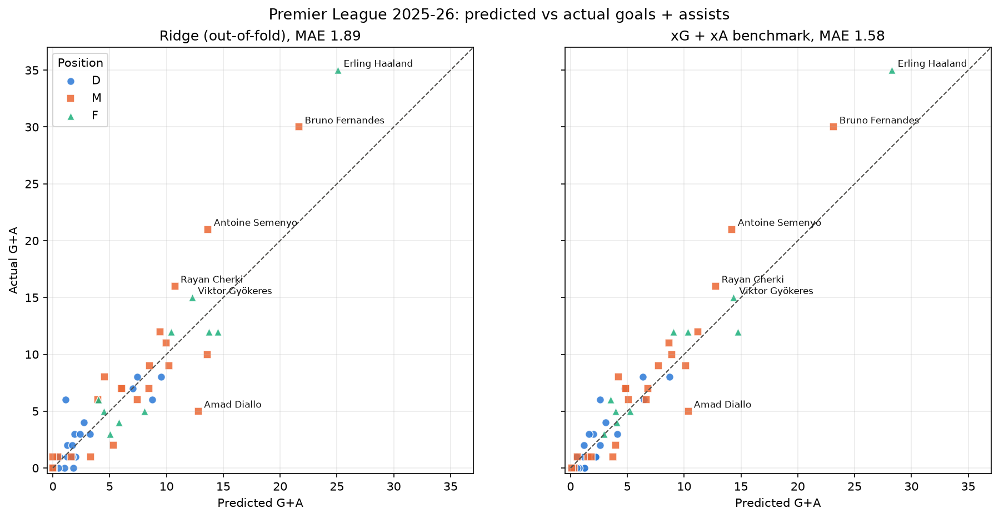
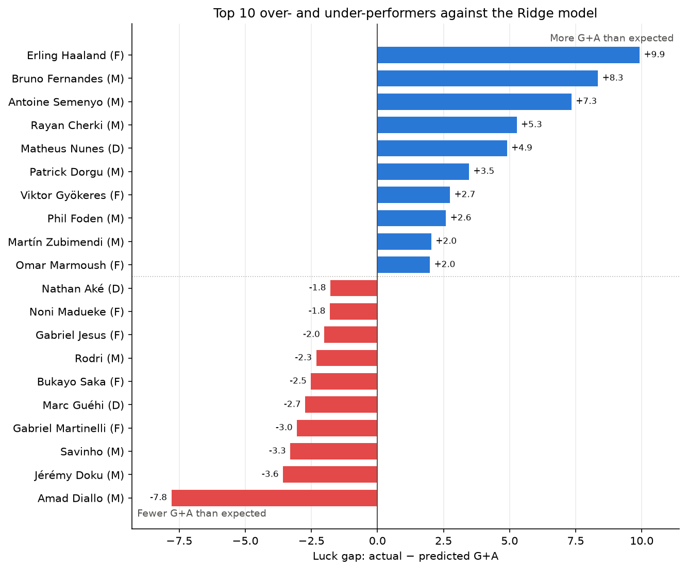

# G+A Predictor: Premier League 2025-26, Predicted vs Actual

Can a player's season goals + assists be predicted from how much they shoot and create? This project trains four models on 2025-26 Premier League player stats, chooses the best one using cross-validation, and compares its predictions with what actually happened. It also compares them with the data provider's expected goals + expected assists (xG + xA).



## Results

5-fold cross-validation, so every player is predicted by a model that never saw them during training. MAE is the average error in goals + assists per player.

| Model | CV MAE | CV R² |
|---|---|---|
| xG + xA (provider benchmark) | 1.58 ± 0.49 | 0.75 |
| Linear Regression | 1.88 ± 0.57 | 0.51 |
| **Ridge (chosen)** | **1.89 ± 0.55** | **0.50** |
| Random Forest | 2.29 ± 0.77 | 0.40 |
| Gradient Boosting | 2.51 ± 0.92 | 0.43 |

**Ridge was chosen.** Plain Linear Regression scored almost the same (0.01 lower MAE, well within one fold-std), but without Ridge's penalty the overlapping shooting stats pull against each other: it gives shots on target a *negative* weight to offset a large weight on total shots. Ridge is just as accurate, and its coefficients make sense. Random Forest is technically within one fold-std too, but it's the more complex model, so the tie-break still favours Ridge. With only 55 players, the tree models don't have enough data to learn reliable non-linear patterns, so they mostly add variance. G+A grows roughly in line with shots and chances created, which is exactly what a linear model assumes.

The provider's xG + xA is still more accurate, because it's built from shot-level data (location, angle, shot type) that isn't in the season-total stats used here.

## The luck gap

`gap = actual G+A − predicted G+A`, using the out-of-fold Ridge predictions. A positive gap means a player produced more than their shots and chances suggest (clinical, lucky, or taking penalties). A negative gap means they produced less (wasteful or unlucky).



- **Penalties explain a lot of it.** The five penalty takers average +5.2 G+A above prediction, against −0.1 for everyone else. Haaland, Bruno Fernandes and Semenyo, the top three over-performers, all take penalties.
- **It isn't just the model.** The Ridge gap correlates 0.87 with the gap against the provider's xG + xA, so two very different predictors mostly agree on who over- and under-performed. Doku is the main exception: Ridge expected more from his shot volume, but xG + xA says he slightly beat the quality of his chances.
- **Assists matter more than finishing.** The top 10 over-performers beat their xA by more than their xG. Bruno Fernandes is about 8.7 assists above his xA but 1.8 goals below his xG, so his over-performance comes from teammates finishing his chances.
- **Biggest under-performer:** Amad Diallo, with 5 G+A against about 13 predicted. He's below both his xG and his xA.
- **Part of the gap is the model:** the gap rises with the prediction (correlation 0.31), so Ridge under-predicts the highest-volume players.

The gap mixes luck, finishing skill, penalties and teammates, and one season can't separate them.

## Data

- One row per player for the whole 2025-26 season, 113 stat columns.
- Covers **Arsenal, Manchester City and Manchester United** only.
- After cleaning, **55 outfield players with at least 5 appearances** remain.
- The CSV isn't included in the repo. Place it at `data/premier_league_complete_stats_whole2025-2026_season.csv`.

**Features:** shots, shots on target, blocked shots, big chances created and missed, key passes, penalty misses, appearances, minutes, final-third and opposition-half passes, crosses, dispossessions, and position.

**Leakage handling:** a column that contains the target, or is calculated from it, can't be a feature. That rules out:
- goals and assists themselves
- conversion rates
- goals split by type (penalty, header, left foot, right foot and so on)
- `scoringFrequency`
- player ratings, which reward scoring

The notebook asserts that none of these are in the feature list.

## Method

1. Clean the data: drop players with no stats, goalkeepers, and players with fewer than 5 appearances. Fill missing counts with 0.
2. Build a scikit-learn `Pipeline`: `ColumnTransformer` (`StandardScaler` for numeric features, `OneHotEncoder` for position), then the model. The pipeline stops test data from leaking into preprocessing.
3. Evaluate with 5-fold shuffled cross-validation (`random_state=42`), clipping predictions at 0. A single 80/20 split was also run, but its 11 test players had too little spread in G+A for R² to mean much, so CV MAE is the main metric.
4. Choose the model with the lowest CV MAE. If two are within one fold-std, choose the simpler one, or the one with stable, readable coefficients.

## Limitations

- **Small, narrow sample:** 55 players from 3 teams, so results may not carry over to the whole league.
- **One season** of data.
- **Assists depend on teammates** finishing chances, so they're noisier than goals.
- **Luck is mixed with skill:** the gap between actual and predicted blends luck, finishing skill, penalties and set pieces, and can't separate them on its own.

## Next steps

- A second season to test the luck gap: skill should persist from one season to the next, luck shouldn't.
- More teams.
- Hyperparameter tuning.
- SHAP feature importance.

## Running it

```
python -m venv .venv
.venv\Scripts\activate
pip install -r requirements.txt
```

Then open `notebooks/ga_predictor.ipynb` with the `.venv` kernel and choose **Run All**. The charts are saved to `outputs/` (`predicted_vs_actual.png` and `luck_gap.png`).

### Demo: look up a player

```
python demo.py
```

Type a player's name, or part of it. Accents are optional, so `gyokeres` finds Gyökeres. The demo shows that player's actual G+A and the Ridge model's predicted G+A:

```
Player: saka
  Bukayo Saka (Arsenal, F)
  Actual G+A:     12  (goals 7, assists 5)
  Predicted G+A:  15
  Luck gap:       -3  -> fewer than the model expected
```

The predictions are the same out-of-fold predictions as in the notebook, so each player is predicted by a model that never saw them. Players the model doesn't cover (goalkeepers, or fewer than 5 appearances) get a message saying why.
